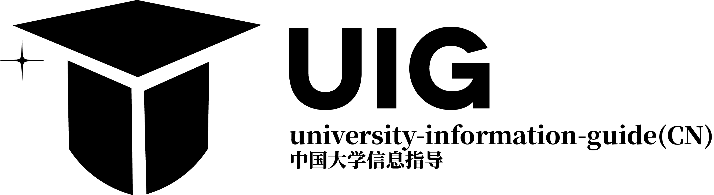
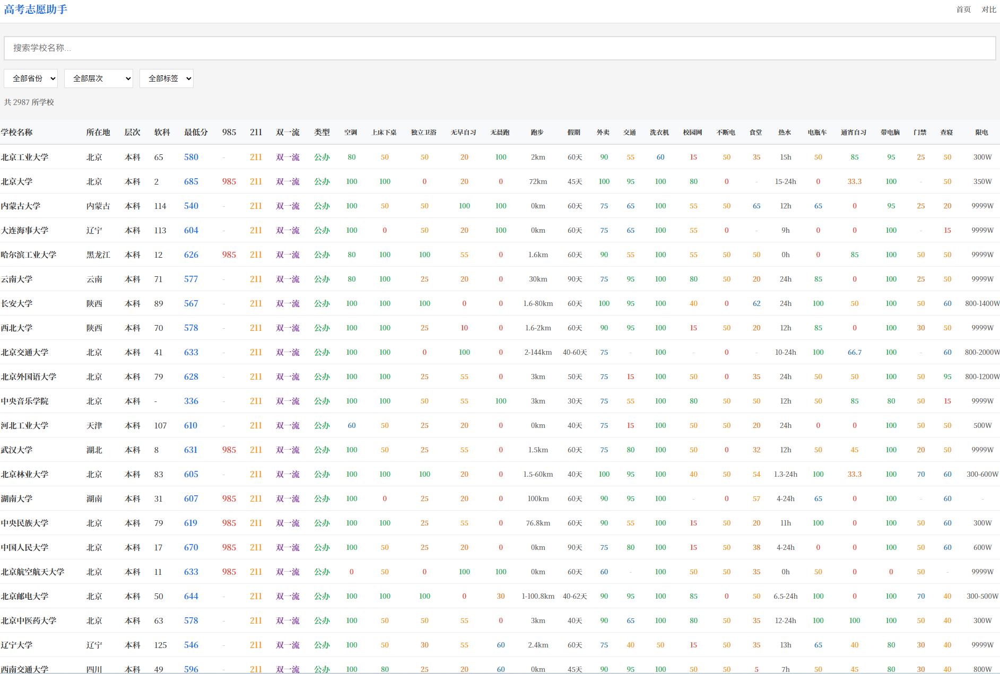
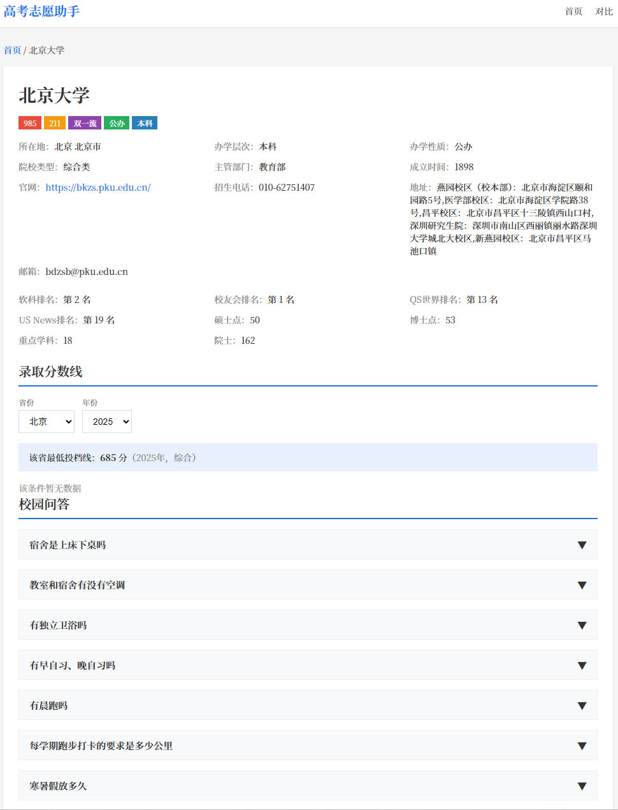

# UIG — 中国大学信息指导




*首页：搜索、筛选、排序与无限滚动浏览全国大学*

一个帮助中国学生进行高考志愿选择的 Web 应用，可视化展示大学信息、录取分数线和校园生活问答。

## 功能特色

- **搜索与筛选**：按名称、省份、层次、标签（985/211/双一流）查找大学
- **学校详情**：基本信息、排名、特色专业、学生社区 FAQ
- **分数线图表**：按省份/年份/科类动态查询各专业录取分数线
- **学校对比**：最多 4 所大学并排对比


*学校详情页：基本信息、特色专业、分数线查询与校园问答*

## 技术栈

- **框架**：Next.js 14（App Router，SSG + API 路由）
- **语言**：TypeScript + React
- **数据来源**：掌上高考 (gaokao.cn) + 社区 FAQ
- **爬虫**：Python（并发获取学校列表、分数线、FAQ）

## 快速开始

```bash
# 安装依赖
npm install

# 启动开发服务器
npx next dev

# 生产构建
npx next build
```

## 项目结构

```
├── src/
│   ├── app/
│   │   ├── page.tsx              # 首页（搜索 + 筛选 + 学校列表）
│   │   ├── school/[id]/page.tsx  # 学校详情页
│   │   ├── compare/page.tsx      # 学校对比页
│   │   └── api/scores/route.ts   # 分数线代理 API
│   ├── components/
│   │   ├── HomeClient.tsx        # 首页客户端组件
│   │   ├── SchoolCard.tsx        # 学校表格行
│   │   ├── FaqSection.tsx        # FAQ 手风琴组件
│   │   └── CompareClient.tsx     # 对比表格组件
│   └── lib/
│       ├── types.ts              # TypeScript 类型定义
│       ├── constants.ts          # 省份/类型常量
│       └── data.ts               # 服务端数据加载
├── crawler/
│   ├── run.py                    # 爬虫运行入口
│   ├── school_list.py            # 爬虫1：学校列表 + 基本信息
│   ├── crawl_scores.py           # 爬虫2：录取分数线（断点续爬）
│   └── parse_faq.py              # 爬虫3：解析社区 FAQ 数据
├── scripts/pipeline/             # 数据处理管道
│   ├── step1_rule_match.py       # 规则匹配指数
│   ├── step2_prepare.py          # 准备 LLM 批次
│   ├── step3_merge.py            # 合并结果
│   ├── clean_outliers.py         # 离群值清理
│   └── verify_all.py             # 完整性验证
├── data/                         # 生成的数据文件
│   ├── schools.json              # 2987 所大学
│   ├── faq.json                  # 2207 条 FAQ 匹配数据
│   ├── scores.json               # 录取分数线数据（前端使用实时 API，此文件为爬虫备份）
│   ├── search-index.json         # 搜索索引
│   └── school_indices.json       # 20 项生活质量指数
└── 推.bat                        # Git 发布助手脚本
```

## 数据来源

- **学校数据**：[掌上高考](https://www.gaokao.cn) — 学校列表、简介、排名
- **分数线**：[掌上高考 API](https://api.zjzw.cn) — 各专业录取分数线（通过代理实时获取）
- **校园 FAQ**：[CollegesChat/university-information](https://github.com/CollegesChat/university-information) — 学生社区贡献的问答数据

## 运行爬虫

```bash
pip install requests tqdm
python crawler/run.py
```

## 运行测试

```bash
npm test            # 运行测试
npm run test:watch  # 监听模式
npm run test:coverage  # 覆盖率报告
```

## 许可证

Apache 2.0 — 详见 [LICENSE](LICENSE) 和 [NOTICE](NOTICE)。

---

[English README](README_EN.md)
